<div align="center">

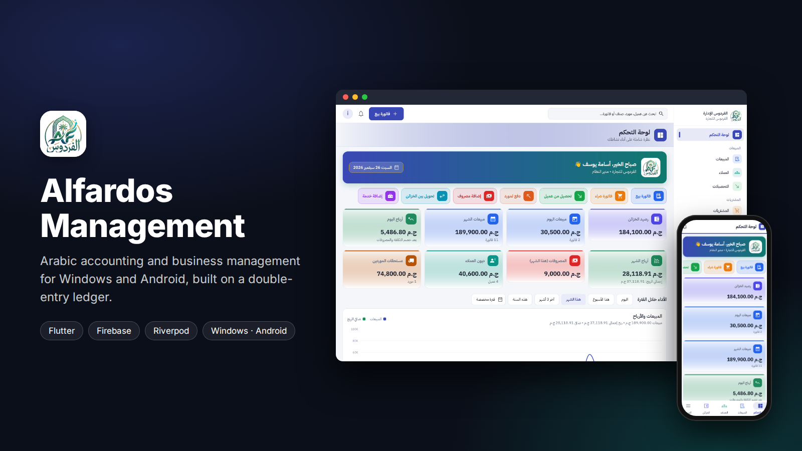

<br/>

[](https://flutter.dev)
[](https://firebase.google.com)
[](https://riverpod.dev)
[](#getting-started)
[](#tests)

**Arabic accounting and business management for small and medium businesses.**
Sales and purchase invoices, customers and suppliers, cashboxes, expenses, stock and reports,
all posted through one double-entry ledger so the numbers always add up.

الفردوس للإدارة — نظام محاسبة وإدارة أعمال عربي بالكامل (RTL) يعمل على ويندوز وأندرويد.

[Screenshots](#screenshots) · [Features](#features) · [Accounting engine](#accounting-engine) · [Security](#security) · [Getting started](#getting-started)

</div>

---

## Screenshots

> Captured from the running app with sample data.

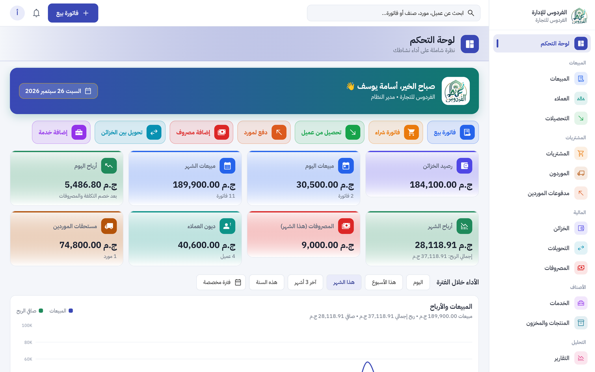
<p align="center"><sub><b>Dashboard</b> · quick actions, cash balance, today's and this month's sales and profit, customer and supplier balances</sub></p>

<table>
  <tr>
    <td width="50%">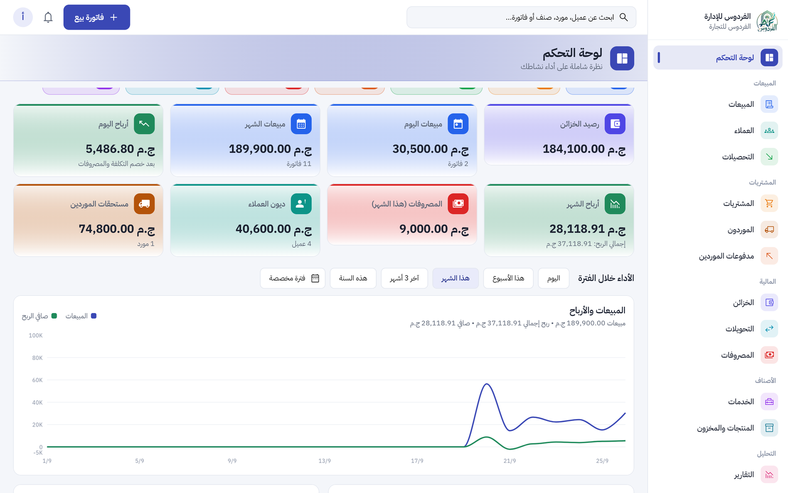<br/><sub><b>Performance</b> · sales and net profit over any period</sub></td>
    <td width="50%">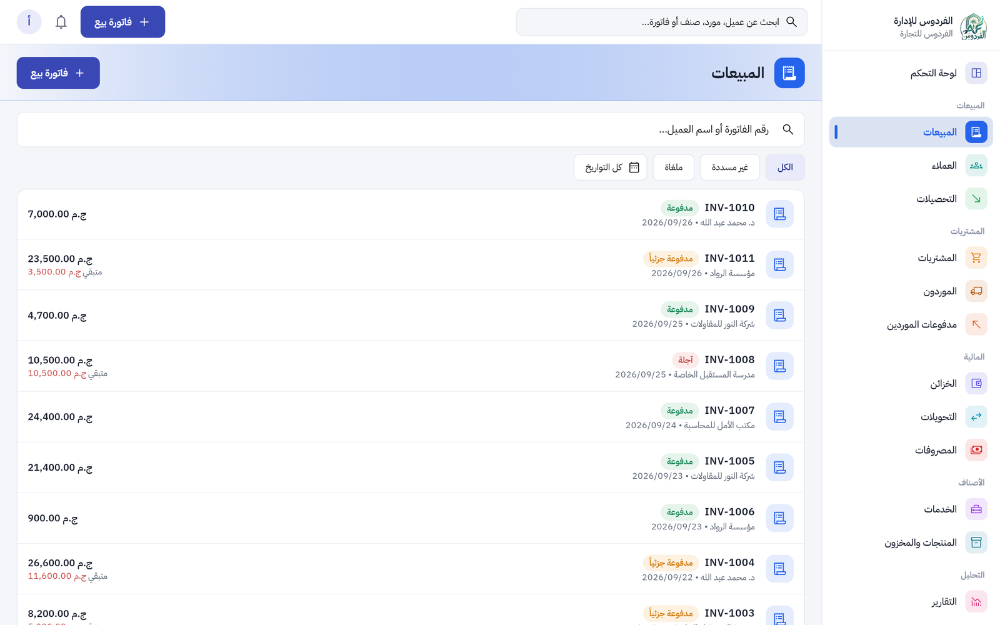<br/><sub><b>Sales invoices</b> · paid, partly paid and credit, with outstanding amounts</sub></td>
  </tr>
  <tr>
    <td width="50%">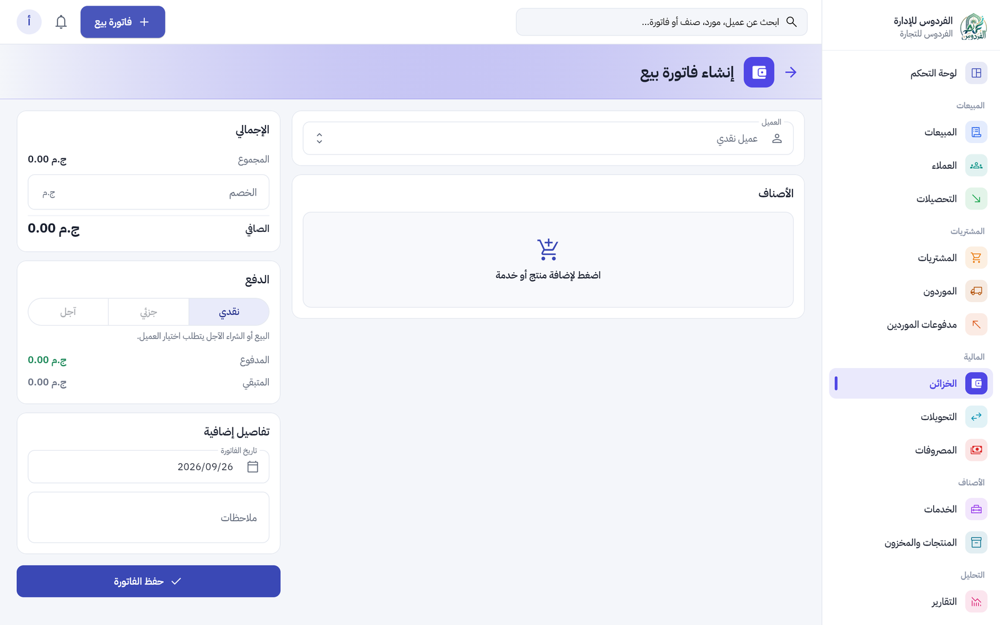<br/><sub><b>New sale</b> · products and services, discount, cash / partial / credit</sub></td>
    <td width="50%">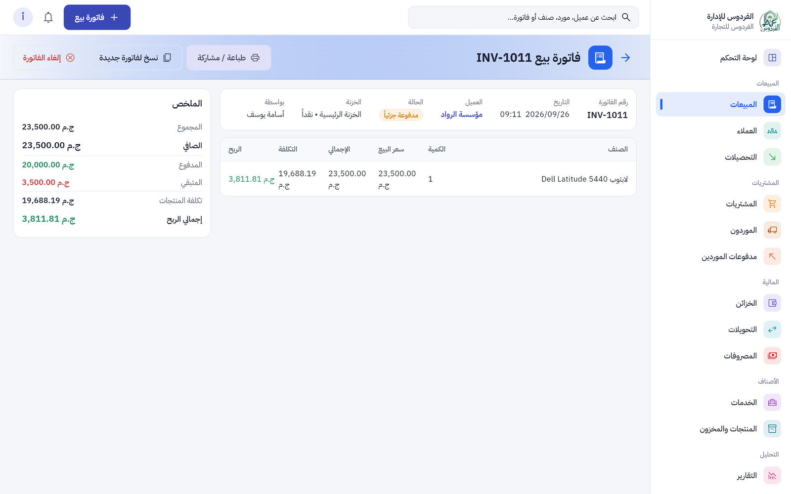<br/><sub><b>Invoice details</b> · cost and profit per line, print, copy or cancel</sub></td>
  </tr>
  <tr>
    <td width="50%">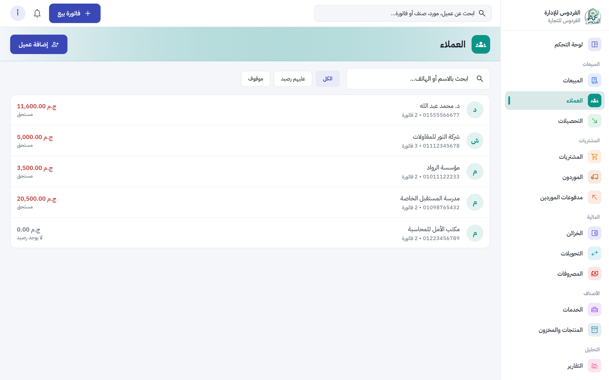<br/><sub><b>Customers</b> · balances and invoice counts</sub></td>
    <td width="50%">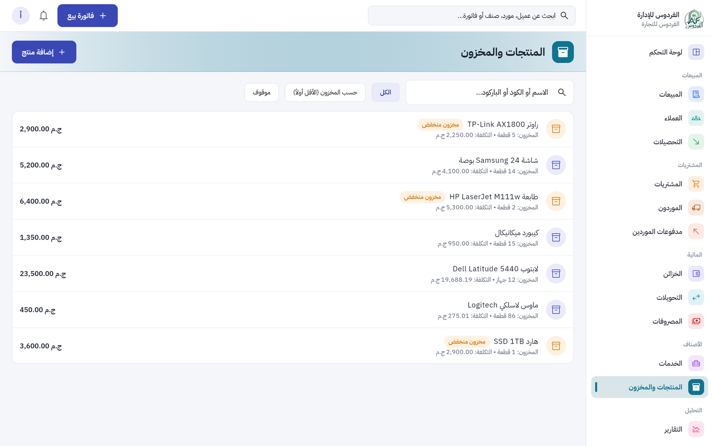<br/><sub><b>Products and stock</b> · weighted-average cost and low-stock flags</sub></td>
  </tr>
  <tr>
    <td width="50%">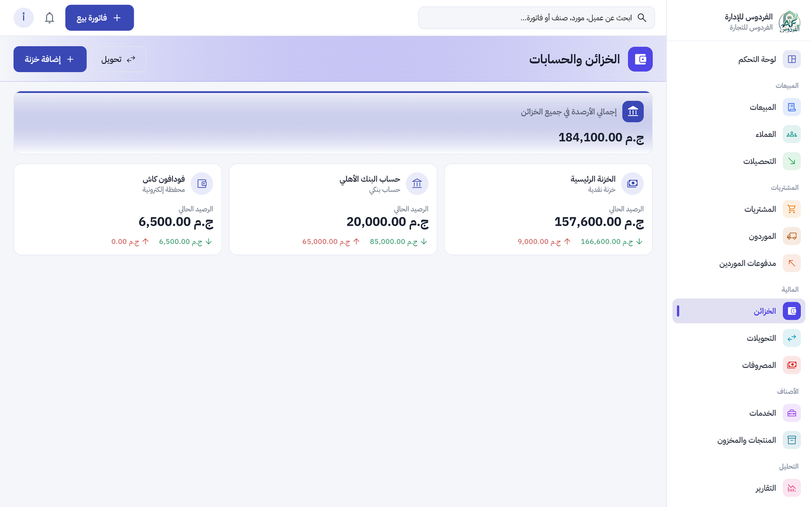<br/><sub><b>Cashboxes</b> · cash, bank and e-wallet accounts</sub></td>
    <td width="50%">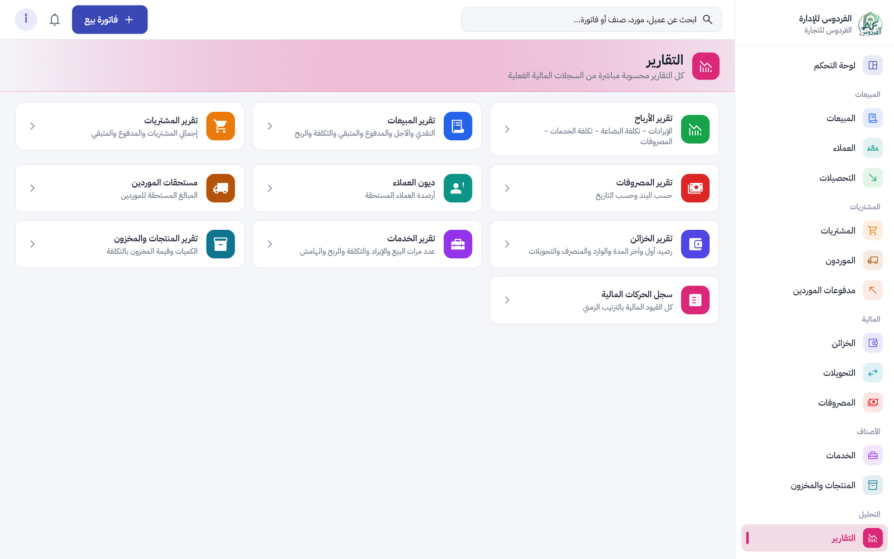<br/><sub><b>Reports</b> · profit, sales, purchases, expenses, debts, stock and the journal</sub></td>
  </tr>
</table>

<table>
  <tr>
    <td align="center" width="33%">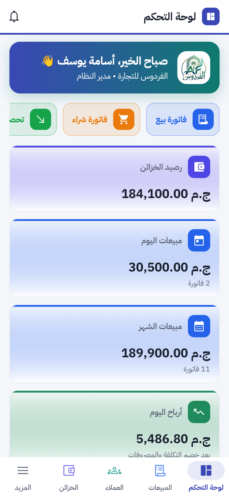<br/><sub><b>Android</b> · the same app with a bottom navigation bar</sub></td>
    <td align="center" width="67%"><br/><sub><b>Sign in</b></sub></td>
  </tr>
</table>

## Features

- **Dashboard:** sales, gross and net profit, expenses and cash flow, customer debts and supplier dues, with period filters and charts
- **Sales and purchase invoices:** cash, credit or partial payment; products and services on the same invoice; invoice discounts spread across the lines
- **Customers and suppliers:** statements of account and opening balances
- **Receipts and payments:** collect from customers, pay suppliers, move money between cashboxes, record expenses by category (with attachments)
- **Stock:** products with weighted-average cost; services with their own cost and profit
- **Manufactured products:** a product built from a recipe of stock items; selling it consumes its components at their current cost, and cancelling the sale returns them
- **Reports:** profit, sales, purchases, expenses, debts, cashboxes, services, stock and the journal; export to PDF and Excel / CSV
- **Users and roles:** built-in roles (admin, accountant, cashier, sales) plus custom roles with granular permissions such as `view_cost` or `cancel_sales`
- **Audit log and notifications:** every change records who, what, when and where; alerts for low cash and large expenses
- **Printing:** Arabic PDF invoices and statements, ready to print or share
- **Offline reading:** data stays readable from the local cache; money operations wait for the server so balances never diverge
- **First run:** a one-time setup screen creates the admin account and seeds roles, settings, the main cashbox and expense categories

## Accounting engine

Every financial operation becomes one balanced `Posting` and is written in a **single atomic
Firestore transaction**: balances, stock, statistics and the audit trail are all written
together, or nothing is. Cancelling creates an exact reversing entry; financial records are
never deleted.

| Operation | Cash | Customers | Suppliers | Stock | Profit & loss |
|:--|:--|:--|:--|:--|:--|
| Cash sale | + | – | – | − qty at cost | sales, cost of goods |
| Credit sale | – | + | – | − qty at cost | sales, cost of goods |
| Customer payment | + | − | – | – | – |
| Purchase | − paid | – | + remaining | + qty | purchases (not an expense) |
| Supplier payment | − | – | − | – | – |
| Expense | − | – | – | – | expenses |
| Transfer A → B | A −, B + | – | – | – | none |
| Cancellation | exact negation of the original posting, dated today | | | | |

- **Double-entry check:** `Δcash + Δreceivables + Δinventory − Δpayables − service cost = net profit + capital`. Unbalanced postings are rejected.
- **Profit** = revenue − cost of goods sold (actual weighted-average cost at the time of sale) − service cost − expenses.
- **Money** is stored as integer minor units (1/100). Invoice discounts use the largest-remainder method, so no piastre is lost.
- **Idempotent:** each form reserves a posting id when it opens, so a double tap or a network retry never posts twice.

The full design, including the Firestore schema, is in [`docs/ARCHITECTURE.md`](docs/ARCHITECTURE.md).

## Security

Firestore rules (tested in `test/firestore_rules`) protect the books even from a modified client:

- Only **active members** can access data, and permissions are checked on the server.
- **No deletes anywhere.** Posted documents can only move from `active` to `cancelled`, together with the reversing transaction.
- A balance can change only when the same write creates a new sub-ledger record for that account with exactly the same amount.
- Counters only increase by one; audit logs are append-only and must name their real author.
- App Check on Android (Play Integrity in release), Crashlytics for crash reporting, no secrets in the client.

## Tech stack

| Area | Choice |
|:--|:--|
| UI | Flutter, Material 3, full RTL, Material Symbols |
| State and DI | Riverpod |
| Navigation | `go_router`, responsive shell (sidebar on desktop, compact rail on tablet, bottom bar on phone) |
| Backend | Firebase Auth, Cloud Firestore (with offline cache), Storage, App Check, Crashlytics, Analytics |
| Charts | `fl_chart` |
| Export | `pdf`, `printing`, `csv`, `share_plus` |

```
presentation   screens and widgets            features/*/presentation
application    Riverpod providers             features/*/application
domain         models, pure accounting        core/accounting, features/*/domain
data           repositories                   features/*/data
ledger         the only code that moves money core/ledger/ledger_service.dart
```

`core/accounting` is pure Dart with no Flutter or Firebase imports, and it is fully unit-tested.

## Getting started

```bash
flutter pub get
flutter run -d windows            # Windows
flutter build apk --release       # Android
```

On first launch choose **"إعداد النظام لأول مرة"** to create the admin account (this works only once).

Run against the local Firebase emulators:

```bash
firebase emulators:start --only auth,firestore,storage
flutter run --dart-define=USE_EMULATOR=true
```

Deploy rules and indexes:

```bash
firebase deploy --only firestore,auth --project <your-project>
firebase deploy --only storage --project <your-project>
```

## Tests

```bash
flutter test      # accounting core and ledger service
firebase emulators:exec --only firestore --project demo-alfardos "npm --prefix test/firestore_rules test"
```

## Author

**Osama Yosef** · Flutter developer, Cairo

[](https://github.com/osama-Yosef)
[](https://www.linkedin.com/in/osama-yosef-819268319)
[](https://upwork.com/freelancers/~014ebd205ef38ca04c)
[](mailto:osamayosef038@gmail.com)
